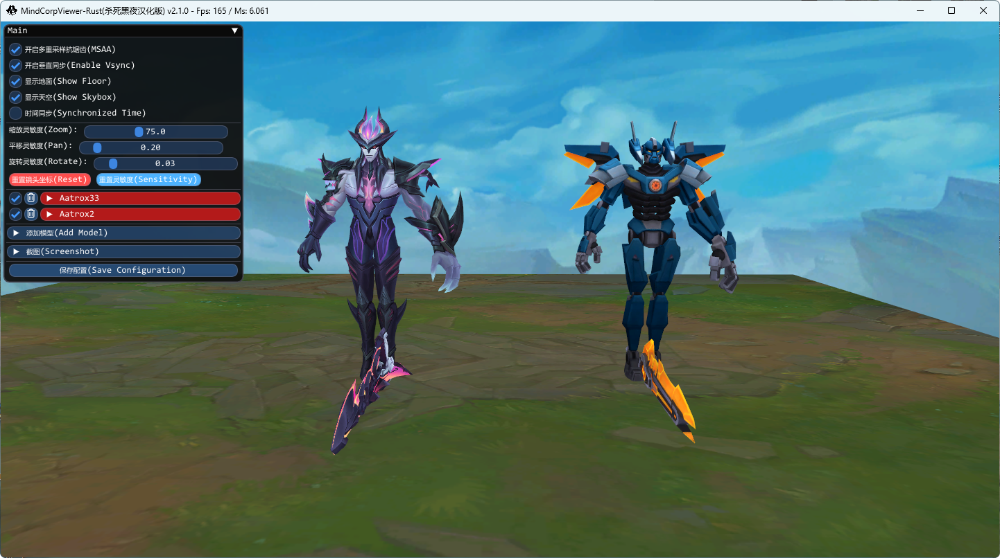
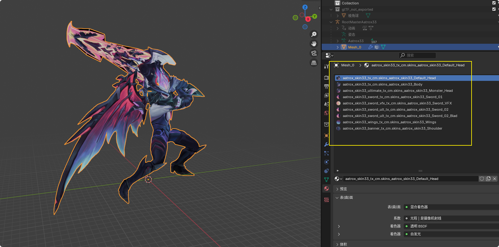

# MindCorpViewer-Rust-darkness
## 在原版的基础上增加:
    1、选择skn文件自动匹配其他路径
    2、导出模型时材质球分离
    3、镜头灵敏度调整
    4、重置镜头坐标
    5、每个模型都可以调整XYZ轴参数
    6、增加单模型config json 导入 ，用python快速生成脚本方法：https://github.com/darkness-A/parse_tex

## On the basis of the original version, add:
    1、Select SKN file to automatically match with other paths
    2、Material ball separation during model export
    3、Lens sensitivity adjustment
    4、Reset lens coordinates
    5、Each model can adjust the XYZ axis parameters
    6、Add single model config json import ， https://github.com/darkness-A/parse_tex

## Help From:
* https://github.com/autergame/MindCorpViewer-Rust
* https://github.com/Querijn/LeagueModel
* https://github.com/CommunityDragon/CDTB
* https://github.com/LoL-Fantome/LeagueToolkit

* 

